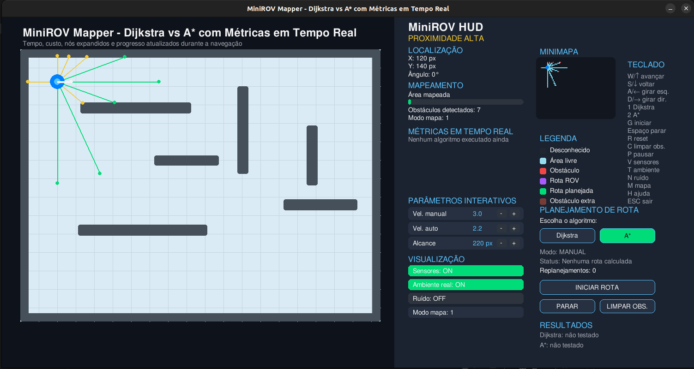

# MiniROV Mapper Simulator

## Overview

**MiniROV Mapper** is an educational Python simulator developed with **Pygame** to demonstrate concepts of **localization, mapping, obstacle detection, autonomous navigation, and path planning** for a miniROV operating in a confined industrial environment.

The simulator is inspired by applications of miniROVs in the **Oil & Gas industry**, especially for inspection tasks in tanks, ducts, submerged structures, and confined spaces where GPS is not available.

The user can control a virtual miniROV, define start and destination points, compare path planning algorithms, visualize sensor readings, and observe how the robot builds a map of the environment.

---

## Simulator Interface Preview

The image below shows the main interface of the MiniROV Mapper simulator.

It contains the simulated tank environment on the left side, where the miniROV navigates, detects obstacles, builds a map, and follows planned routes. The right side contains the interactive HUD, which displays localization data, mapping information, real-time algorithm metrics, adjustable parameters, visualization options, a minimap, keyboard shortcuts, and controls for selecting Dijkstra or A*.

The HUD allows the user to:

- monitor the miniROV position and orientation;
- observe the mapped area percentage;
- compare Dijkstra and A*;
- view time, cost, expanded nodes, and progress;
- adjust manual speed, autonomous speed, and sensor range;
- enable or disable sensors, real environment, noise, and map mode;
- start, stop, and clear planned routes.

This interface helps students understand how localization, mapping, sensing, and path planning are integrated in a robotic inspection system.

### Simulator Screenshot




## Main Features

The simulator includes:

- 2D tank-like environment;
- MiniROV manual control;
- Simulated distance sensors;
- Real-time mapping;
- Obstacle detection;
- Extra obstacle insertion;
- Path planning using:
  - Dijkstra;
  - A*;
- Automatic navigation to a target point;
- Replanning when obstacles are detected;
- Interactive HUD;
- Real-time metrics:
  - search time;
  - movement time;
  - path cost;
  - remaining cost;
  - expanded nodes;
  - progress percentage;
- Keyboard and mouse interaction.

---

## Educational Purpose

This simulator helps students understand:

- how a robot estimates its position in a closed environment;
- how sensors can be used to detect obstacles;
- how a map can be built from sensor data;
- how path planning algorithms work;
- the difference between Dijkstra and A*;
- why autonomous navigation is important in inspection robotics;
- how miniROVs can support inspection tasks in the Oil & Gas industry.

---

## Requirements

To run the simulator, you need:

- Python 3.8 or newer;
- Pygame.

The main dependency is:

```txt
pygame